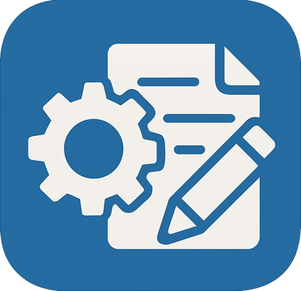

# CVFactory - AI 자기소개서 생성기

<div align="center">
  
  <br>

  [](README.md)
</div>

## 📖 개요

CVFactory는 사용자가 채용 공고를 기반으로 맞춤형 자기소개서를 쉽게 생성할 수 있도록 돕는 AI 기반 웹 애플리케이션입니다. 간단한 프론트엔드 인터페이스와 모든 핵심 기능을 처리하는 강력한 백엔드 서버로 구성되어 있습니다.

백엔드 서버는 웹 페이지에서 정보를 처리 및 추출하고, 웹 스크래핑을 사용하여 정보 추출을 자동화하며, 검색 증강 생성(RAG)과 함께 거대 언어 모델(LLM)을 활용하여 고급 텍스트 생성 작업을 수행합니다. 핵심 기능들은 Celery를 사용하여 비동기 백그라운드 작업으로 관리됩니다.

## ✨ 핵심 기술 (백엔드)

서버는 다음과 같은 몇 가지 주요 기술과 방법론을 사용합니다.

### 데이터 추출 및 전처리

-   **웹 스크래핑/크롤링**: Playwright를 사용하여 동적으로 웹 페이지를 가져오고 렌더링하여 JavaScript 기반 사이트에서도 콘텐츠를 추출합니다.
-   **HTML 파싱**: BeautifulSoup를 사용하여 가져온 HTML을 파싱하고 원하는 텍스트를 정확히 추출합니다.

### 비동기 작업 오케스트레이션

-   **백그라운드 작업 관리**: Celery와 Redis 메시지 브로커를 활용하여 스크래핑, 파싱, LLM 호출과 같은 긴 작업을 비동기적으로 관리함으로써 API 응답성을 보장합니다.

### 생성형 AI 및 고급 텍스트 처리

-   **거대 언어 모델(LLM) 통합**: Groq API를 통합하여 자기소개서와 같은 텍스트를 생성합니다.
-   **검색 증강 생성(RAG)**: Langchain을 사용하여 RAG 파이프라인을 구현하여 LLM의 컨텍스트 이해를 향상시킵니다. Cohere를 사용해 채용 공고 내용의 벡터 임베딩을 생성하고, 이를 FAISS 벡터 저장소에 저장한 뒤, 관련 정보를 검색하여 LLM에 증강된 컨텍스트로 제공합니다.

## 🛠 기술 스택

| 분류 | 기술 요소 |
|----------|--------------|
| 언어 | Python 3.x |
| 백엔드 프레임워크 | FastAPI |
| 비동기 태스크 | Celery |
| 메시지 브로커 | Redis |
| 프론트엔드 | HTML, CSS, JavaScript (정적) |
| 웹 스크래핑/자동화 | Playwright |
| HTML 파싱 | BeautifulSoup4 |
| AI/ML | Langchain, Groq API, Cohere (임베딩용) |
| RAG | FAISS (벡터 저장소) |
| 컨테이너화 | Docker, Docker Compose |
| 배포 | Google Cloud Run |

## 🚀 시작하기

### 필수 요구 사항

-   Docker
-   Docker Compose
-   필수 API 키가 포함된 `.env` 파일 (필요한 키는 `api/core/config.py` 등에서 확인 가능하며, `GROQ_API_KEY`, `COHERE_API_KEY` 등이 필요합니다). 이 파일은 `api/` 디렉토리 내에 위치해야 합니다.

### Docker를 이용한 설치 및 실행

이 프로젝트는 웹 서버와 백그라운드 워커를 관리하는 Docker Compose로 실행되도록 설정되어 있습니다.

1.  **리포지토리 클론:**
    ```bash
    git clone https://github.com/CV-Factory/CVFactoryForLocal.git
    cd CVFactoryForLocal
    ```

2.  **환경 변수 파일 생성:**
    `api/` 디렉토리 내에 `.env` 파일을 생성하고 API 키를 추가합니다.
    ```
    # api/.env
    GROQ_API_KEY=your_groq_api_key
    COHERE_API_KEY=your_cohere_api_key
    # 기본 설정 외 다른 Celery/Redis 연결 정보가 필요하다면 추가
    ```

3.  **애플리케이션 빌드 및 실행:**
    ```bash
    docker-compose up --build
    ```
    이 명령어는 서비스의 Docker 이미지를 빌드하고 FastAPI 웹 서버를 시작합니다.

4.  **애플리케이션 접속:**
    -   웹 인터페이스는 `http://127.0.0.1:8000/` 에서 사용할 수 있습니다.
    -   FastAPI 문서(Swagger UI)는 `http://127.0.0.1:8000/docs` 에서 확인할 수 있습니다.

## ⚙️ CI/CD 파이프라인

이 프로젝트는 GitHub Actions를 사용하여 백엔드 서버를 Google Cloud Run에 배포하는 CI/CD 파이프라인을 갖추고 있습니다.

-   **트리거**: `develop` 브랜치에 새로운 커밋이 푸시될 때 자동으로 시작됩니다.
-   **워크플로우 파일**: `.github/workflows/deploy.yaml`
-   **주요 단계**:
    1.  **코드 체크아웃**: 최신 코드를 가져옵니다.
    2.  **GCP 인증**: Workload Identity Federation을 사용하여 키 없이 안전하게 Google Cloud에 인증합니다.
    3.  **Docker 이미지 빌드 및 푸시**: 루트 `Dockerfile`을 사용하여 애플리케이션의 Docker 이미지를 빌드하고 Google Artifact Registry에 푸시합니다.
    4.  **Cloud Run에 배포**: 새 이미지를 Google Cloud Run의 `cvfactory-server` 서비스에 배포합니다.

## 📁 프로젝트 구조

```
.
├── api/                   # FastAPI 백엔드 소스 코드
│   ├── main.py            # FastAPI 애플리케이션 진입점 및 API 엔드포인트
│   ├── celery_app.py      # Celery 애플리케이션 인스턴스 설정
│   ├── celery_tasks.py    # Celery 백그라운드 작업 정의
│   ├── tasks/             # Celery 파이프라인의 각 단계를 위한 모듈
│   ├── core/              # 핵심 유틸리티 및 설정 (LLM, 로깅)
│   └── utils/             # 일반 유틸리티 함수
├── static/                # 프론트엔드용 정적 파일 (CSS, JS)
├── .github/               # GitHub Actions CI/CD 워크플로우
├── Dockerfile             # 애플리케이션의 Docker 이미지 정의
├── docker-compose.yml     # 로컬 개발을 위한 서비스 정의
├── requirements.txt       # Python 의존성 목록
├── index.html             # 메인 프론트엔드 페이지
├── README.md              # 영문 README
└── README.kr.md           # 한국어 README (현재 파일)
```

## 📄 라이선스

이 프로젝트는 MIT 라이선스를 따릅니다. 자세한 내용은 [LICENSE](LICENSE) 파일을 참고하세요.

## 📬 문의

wintrover@gmail.com